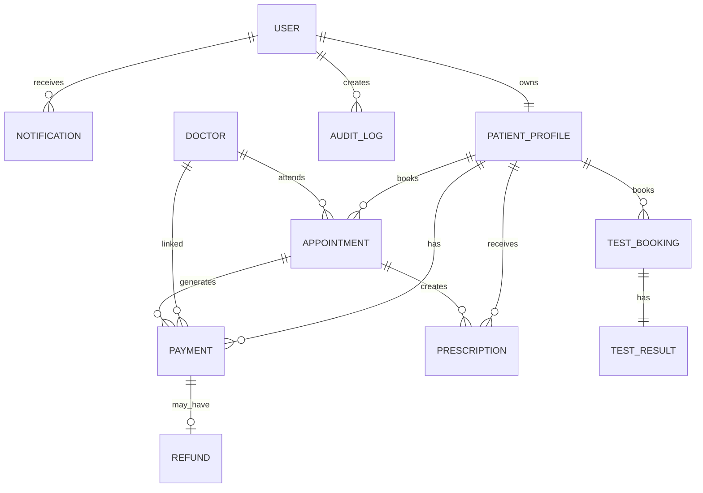

# ER Overview

```mermaid
erDiagram
    USER ||--o{ NOTIFICATION : receives
    USER ||--|| PATIENT_PROFILE : owns
    USER ||--o{ AUDIT_LOG : creates
    PATIENT_PROFILE ||--o{ APPOINTMENT : books
    PATIENT_PROFILE ||--o{ PAYMENT : has
    PATIENT_PROFILE ||--o{ PRESCRIPTION : receives
    PATIENT_PROFILE ||--o{ TEST_BOOKING : books
    DOCTOR ||--o{ APPOINTMENT : attends
    DOCTOR ||--o{ PAYMENT : linked
    APPOINTMENT ||--o{ PAYMENT : generates
    APPOINTMENT ||--o{ PRESCRIPTION : creates
    TEST_BOOKING ||--|| TEST_RESULT : has
    PAYMENT ||--o| REFUND : may_have
```
