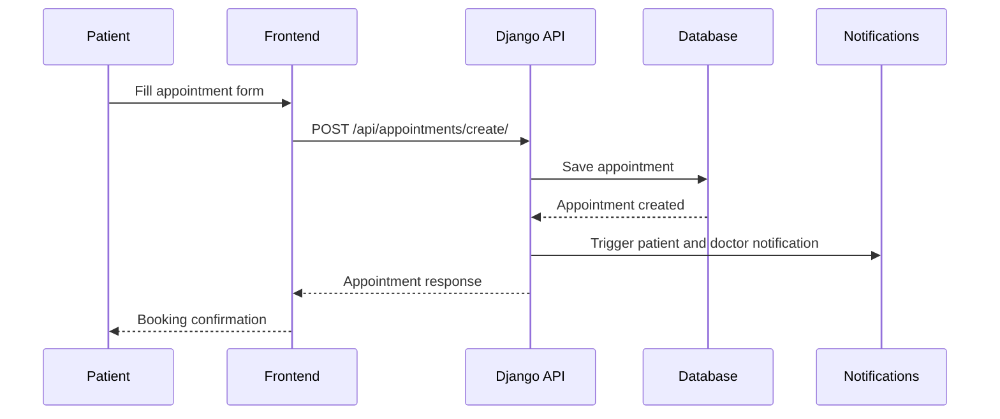

# Sequence Diagram: Appointment Booking

```mermaid
sequenceDiagram
    participant P as Patient
    participant F as Frontend
    participant A as Django API
    participant D as Database
    participant N as Notifications

    P->>F: Fill appointment form
    F->>A: POST /api/appointments/create/
    A->>D: Save appointment
    D-->>A: Appointment created
    A->>N: Trigger patient and doctor notification
    A-->>F: Appointment response
    F-->>P: Booking confirmation
```
