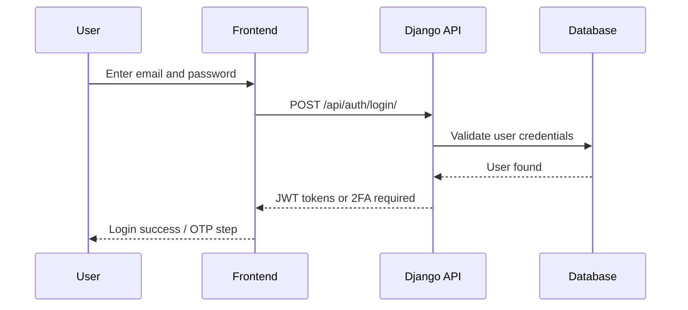

# Sequence Diagram: Login

```mermaid
sequenceDiagram
    participant U as User
    participant F as Frontend
    participant A as Django API
    participant D as Database

    U->>F: Enter email and password
    F->>A: POST /api/auth/login/
    A->>D: Validate user credentials
    D-->>A: User found
    A-->>F: JWT tokens or 2FA required
    F-->>U: Login success / OTP step
```
