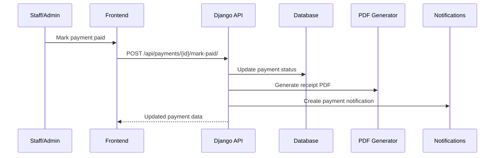

# Sequence Diagram: Payment

```mermaid
sequenceDiagram
    participant S as Staff/Admin
    participant F as Frontend
    participant A as Django API
    participant D as Database
    participant P as PDF Generator
    participant N as Notifications

    S->>F: Mark payment paid
    F->>A: POST /api/payments/{id}/mark-paid/
    A->>D: Update payment status
    A->>P: Generate receipt PDF
    A->>N: Create payment notification
    A-->>F: Updated payment data
```
