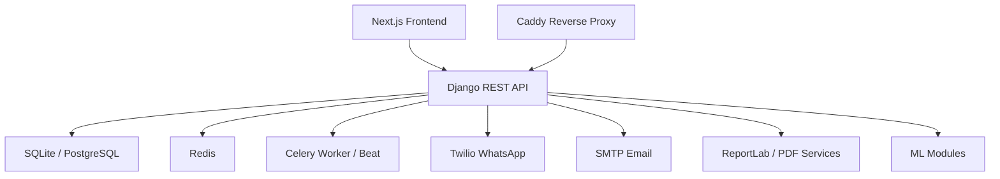

# System Architecture

```mermaid
flowchart TD
    ui["Next.js Frontend"] --> api["Django REST API"]
    api --> db["SQLite / PostgreSQL"]
    api --> redis["Redis"]
    api --> celery["Celery Worker / Beat"]
    api --> twilio["Twilio WhatsApp"]
    api --> smtp["SMTP Email"]
    api --> pdf["ReportLab / PDF Services"]
    api --> ml["ML Modules"]
    caddy["Caddy Reverse Proxy"] --> api
```
