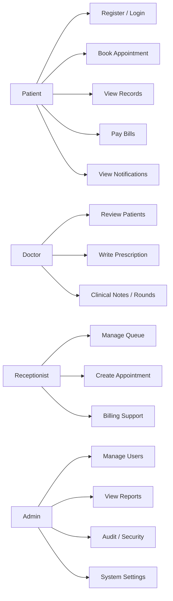

# Use Case Diagram

```mermaid
flowchart LR
    patient["Patient"] --> register["Register / Login"]
    patient --> appointment["Book Appointment"]
    patient --> view_records["View Records"]
    patient --> pay["Pay Bills"]
    patient --> notifications["View Notifications"]

    doctor["Doctor"] --> consult["Review Patients"]
    doctor --> prescribe["Write Prescription"]
    doctor --> rounds["Clinical Notes / Rounds"]

    receptionist["Receptionist"] --> queue["Manage Queue"]
    receptionist --> booking["Create Appointment"]
    receptionist --> billing["Billing Support"]

    admin["Admin"] --> users["Manage Users"]
    admin --> reports["View Reports"]
    admin --> audit["Audit / Security"]
    admin --> settings["System Settings"]
```
